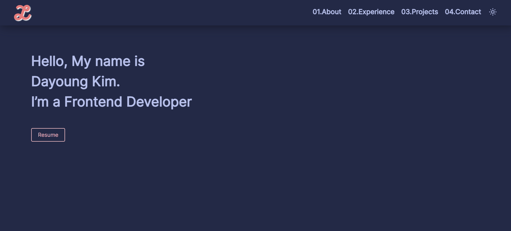

<div align="center">
  
</div>
<h1 align="center">
  dayoungkim.vercel.app
</h1>
<p align="center">
  <a href="https://dayoungkim.vercel.app/" target="_blank">dayoungkim.vercel.app</a> built with <a href="https://nextjs.org/" target="_blank">NextJS</a>, database <a href="https://www.prisma.io/" target="_blank">Prisma</a> and hosted with <a href="https://www.vercel.com/" target="_blank">Vercel</a>
</p>

<div align="center">

       

</div>



## 🚀 Building and Running for Production

1. Generate a full static production build

   ```sh
   npm run build
   ```

1. Preview the site as it will appear once deployed

   ```sh
   npm run serve
   ```

This is a [Next.js](https://nextjs.org/) project bootstrapped with [`create-next-app`](https://github.com/vercel/next.js/tree/canary/packages/create-next-app).

## Getting Started

First, run the development server:

```bash
npm run dev
# or
yarn dev
```

Open [http://localhost:3000](http://localhost:3000) with your browser to see the result.
